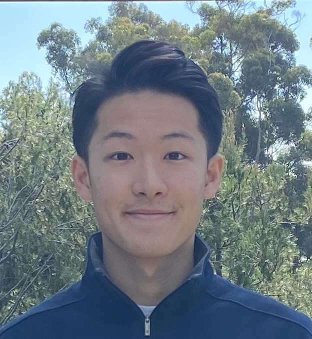
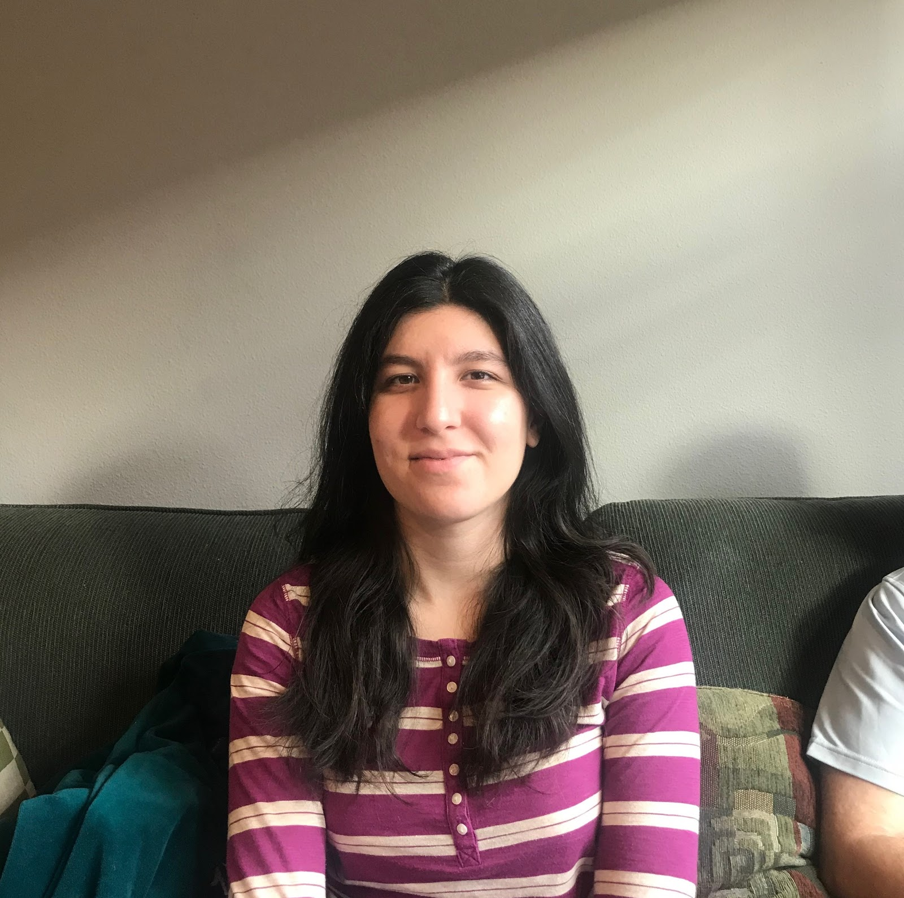
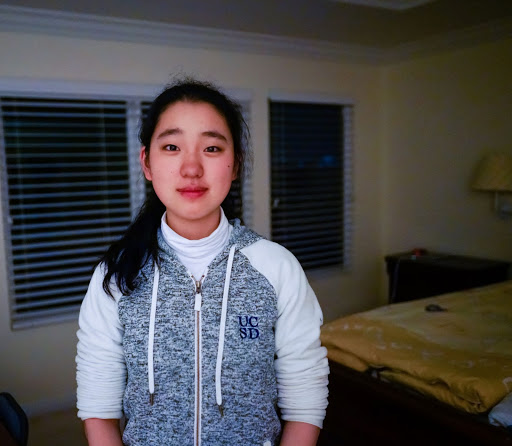
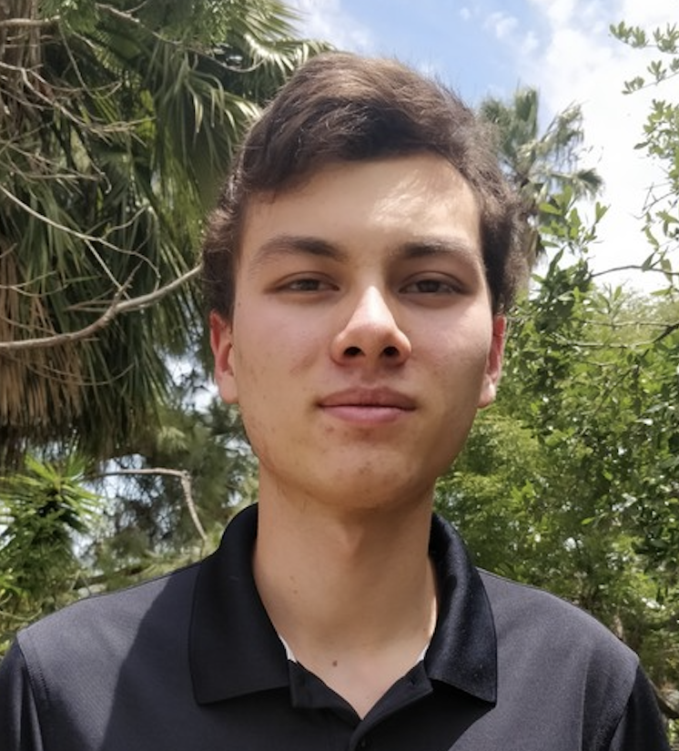
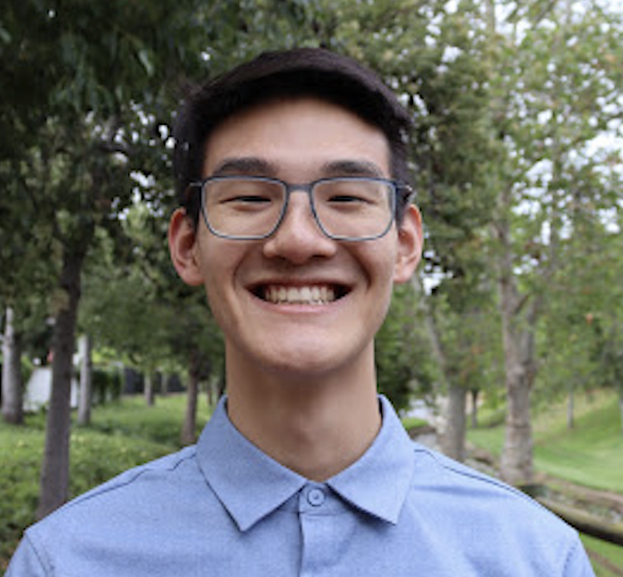
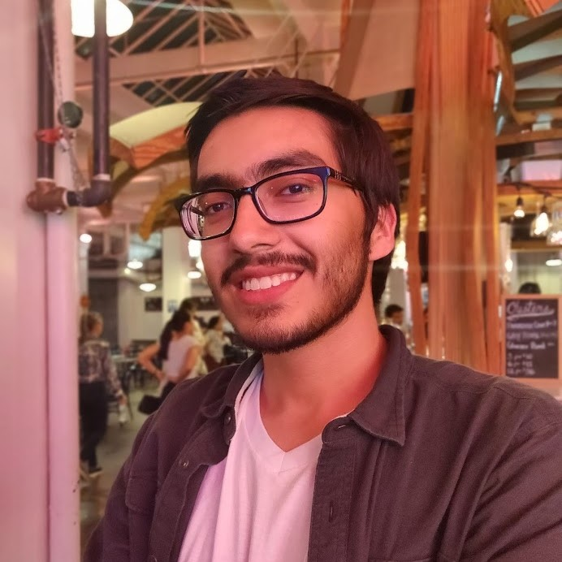

[Home](https://melinucsd.github.io/cse110-team16-tmpwebsite/) > About Us
# Who are we?
## Matias Lin

   
Hey! My name is Matias Lin and I am a junior Muir student studying Bioinformatics under the Computer Science department. I'm very passionate about the possibilities of machine learning in the area of personalized medicine.  
[My Github Profile](https://github.com/matiaslin)
    

## Lara Daneshgaran-Bajastani

   
TODO
    

## Shuhua Xie

   
TODO
    

## Kevin Stubbings 

    
TODO
      

## Samuel Liu

   
Hello! My name is Samuel Liu and I am a 2nd year Warren student studying Computer Science. I love cooking, growing plants, and playing games. 
[My Github Profile](https://github.com/samliu000)
    

## Yuru Zhou

   
My name is Yuru Zhou, a second year undergraduate student majoring in Mathematics & Computer Science. I am interested in web & mobile app development, and passionate about creating innovative solutions for future technology.
[My Github Profile](https://github.com/xxwwyytt1)
     

## Fengdi Liu
   
TODO
    

## Joshue Aguirre

   
My name is Joshue Aguirre. I am a fourth year
Computer Science major. I enjoy listening to music and playing video games. 
[My Github Profile](https://github.com/Yoshisham)
      

## Aven Huang

   
My name is Aven Huang, and I named myself after my dog, Evan, as you can see in my picture. I’m a sophomore student majoring in Data Science.  
[My Github Profile](https://github.com/xxwwyytt1)
        

###### Please do not resize the website :)