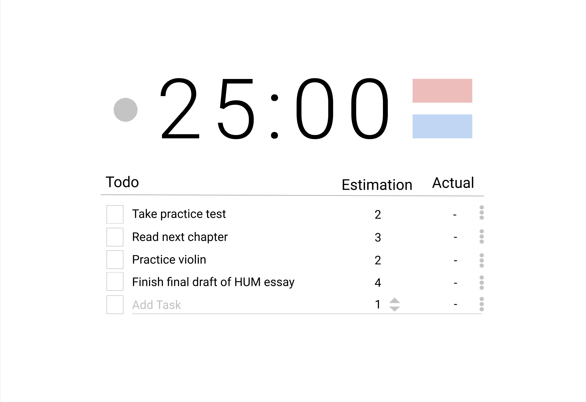
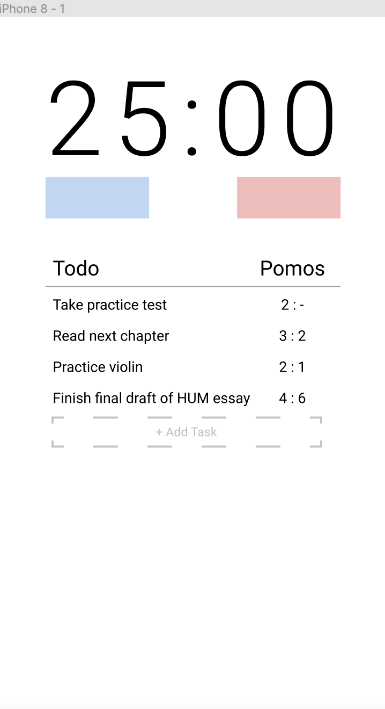

# Pomodoro Timer App

## What people say

"As a student who is also a part-time worker, I don't have a lot of free time on my hands. I need to make the most out of my study time so that I can successful in my studies while at the same time be able to handle the work schedule my employer gives me." - Andrew, 20.   

"As a working adult, it may be hard to concentrate at the office when I am having a long day. My mind will wander and I will produce less quality work if I do not focus." - Olivia, 25.  

"As a writer, I want to be able to disable notifications in order to minimize any distraction and isolate my thoughts to increase my creativity and thinking capabilities." - David, 40.  

"As a student who is desperate for an internship, I want to be able to remind myself to practice leetcode daily and help me concentrate on each task planned throughout the day." - Emma, 19.  

"As a middle school student I don't enjoy doing homework. But my mom tells me that I have to finish my homework before I can play with my friends. Doing homework is boring and I can't concentrate at all." - Peter, 12  

"As a mom and full time student, I want to be able to wisely track my daily tasks and help me keep everything on track. I need to ensure that I don't undermine or forget to complete any of my responsibilities as a mother and as a student. Moreover, the pomodoro timer will help me concentrate on one task at a time and finish them accordingly." - Sophia, 32  

"As an adult who works at an office during the week, I want to be able to keep track of my time and progress on tasks so that I can be efficient in completing my daily and weekly tasks. For instance, I want to be able to use the timer to make sure that I don't spend more time than necessary on accomplishing certain tasks and don't take longer breaks than allowed." - Christian, 28.  

"As a self help enthusiast, I want to be able to keep track of my time usage habits, so that I can know what is distracting me the most when I try to study and which tasks take me the longest. This way I can be realistic when evaluating myself" - Mia, 56   

"As a college student, I want to be able to get my homework done productively, avoid possible distractions that might lead to procrastination." - Mark, 19  

# What do we see?

- COVID-19 exposed one of the problems that students have been facing even before the transition to online classes.  
We lack self-accountability when it comes to being productive and effective when addressing our responsibilities at school.   
The setting of online learning has enhanced our exposure to several sources of distractions, such as our phones, laptops, roommates.  
- Sometimes the sheer number of todo items in our lives can be overwhelming and as a result we simply don’t do any.  

## What do we need?  

- We need a sense of accountability
- We need training to be disciplined
- We need to minimize distractions

## Wouldn’t it be great to have...

- *Something* that designates a set time for work.
- *Something* that regulates our break so that it’s both refreshing and optimal.
- *Something* that allows me to measure my productivity throughout the day.
- *Something* that quantifies my efficiency when completing tasks.
- *Something* that teaches me my productivity patterns.

## Our pomodoro app will...

- *Designate* 25 minute work time with minimal distractions.
- *Allot* 5 minute break time to stimulate a healthy and optimal work session.
- *Provide* statistics that allow users to track their own productivity.
- *Encourage* users to make estimates in regards to their own efficiency.
- *Train* users to quantify and optimize their productivity.
- *Remind* users the tasks to tackle for the day .

## What is a pomodoro timer?

Purpose: encourage productivity by setting a 25 minute timer dedicated to work and 5 minute timer for resting.   

It's no surprise that there are many Pomodoro apps in the market. However, our approach is customer-centered and stands out by empowering users to optimize their:
- Productivity
- Attention span
- Time estimation skills
- Distraction-free work time 

For this reason, there is **no pause** button. We **facilitate** the use of the web app by guiding the users through pop-ups. We **circumvent** from adding connections to outside apps. We **avoid** visual options that might be more distracting than useful. We **Minimize** the complexity of the visual design for web app. All of this to ensure a successful 25 minute work session and a restoring 5 minute break.

## Let’s face it, our app will... 

- Enforce the pomodoro timer to enhance productivity, but the user is responsible to be faithful to follow   
the timer for both the work session (25 minutes) or the break period (5 minutes).
- Aid the user to be more accurate in how they estimate their own productivity,   
but the user is responsible to learn to empirically adjust their predictions.
- Help train the user to be more accountable when focusing on tackling the task at hand,  
but the user is responsible to minimize their exposure to other sources of distractions that might break the pomodoro session.

## This is how it looks like...

*Start/Reset Buttons*:    
- User presses start -> Pomodoro timer starts 
- User presses reset -> Pomodoro restarts from latest Pomodoro
- Timer counts down from 25 min then has 5 min break
- Every 4 Pomodoros there is 15 min break
  
*TODO list*:    
- User adds task to the list
- User selects task and presses start to begin working on it
- User estimates number of Pomodoros the task will take
- User receives a comparison between their estimated and actual results.

In the future we may also expand to mobile:  

